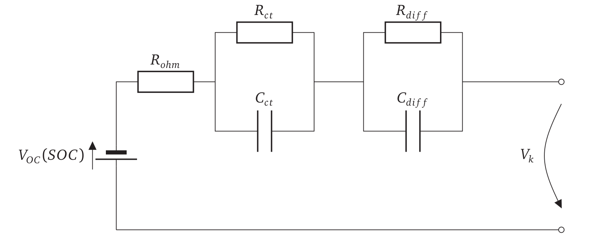

# Python 2RC ECM Battery Model
This repository holds code for an ecm containing 2rc elements. The goal of this model is to estimate the internal resistance of a battery cell or pack. There are two levels in the model: Batterypack ("CELL") and Batterycell ("SYSTEM").

Currently, the model is start-parametrized to represent an 2014 VW e-Golf.

## Dependencies
* Docker 

Inside the docker, we use:
* python 3.8
* Packages: pandas flask gevent gunicorn matplotlib wheel pymongo psutil scipy requests

## Basic functionality and Quickstart
The model is encapsulated in a docker container and can be built as this.

get into the dockerimage folder: `$ cd dockerimage`

Execute `$ . create_docker.sh` This will copy the files and build the docker container tagging it rc_model. Make sure to have sudo rights to build.

Run the container: `$ sudo docker run -p5000:5000 --name ecm ecm_model:latest`. Currently, the port is set to a standard 5000 for flask. If you want to use another port, check ecm/wsgi.py and change it there accordingly.

Run fit(): Evoke the model endpoint *rc_model/fit* using a POST message containing data as this:
`post_data:{
	voltage: [],
	current: [],
	timestamps: [],
	temperature: float,
	fit_level: Either "CELL" or "SYSTEM"
	}`

An example dataset [can be found here](example_data.md). Note that the cell level data hast to be in Ampere and Millivolt, the pack level data hast to be in Ampere and Volts!

Run infer(): Evoke the model endpoint *rc_model/infer* by a POST after calling fit(). The model uses the parameters estimated in fit() before. No parameters needed.

Stop and delete the container:`$ sudo docker stop ecm && sudo docker rm ecm`

### http://container_ip:5000/rc_model/fit
Using the fit function, the model can be fit to a voltage timeseries. Therefore, the voltage, current and a timestamp vector are needed. The time resolution of the data hat do be at least 5 Hz. The container ip is most likely localhost (127.0.0.1) when running on your system. Adapt, when running remote.

### http://container_ip:5000/rc_model/infer
Using infer, the model takes the in fit() generated model parameters and infers an internal resistance after 10s from the model. To do so, the model is excited using a syntetic 50 A current signal. The voltage answer of the model is taken after 10s and a Ri is calculated from this.

## Model
The image shows the circuit implemented in the model. All parameters shown can be fitted by the model, having the V_k and the current as input. 

## Docker environment
The model is encapsulated into a docker container. Base image is ubuntu 20.04, as also the development system was. Using flask from the python side, a gunicorn server serves for dsitributing the load and manages workers. As a default, 8 workers are defined. Check wsgi.py to change this.

### Publication
Find here if published

### Contact
lukas.merkle@tum.de
